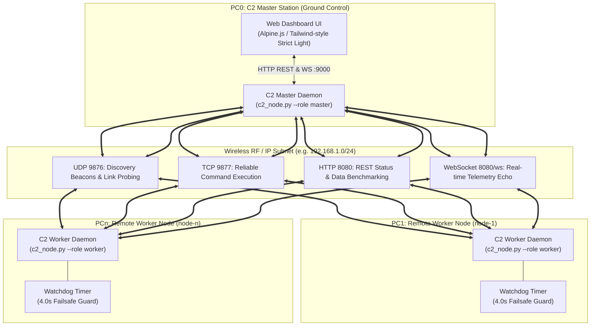
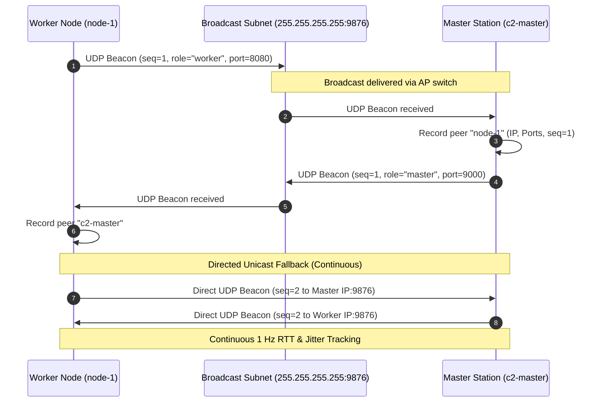
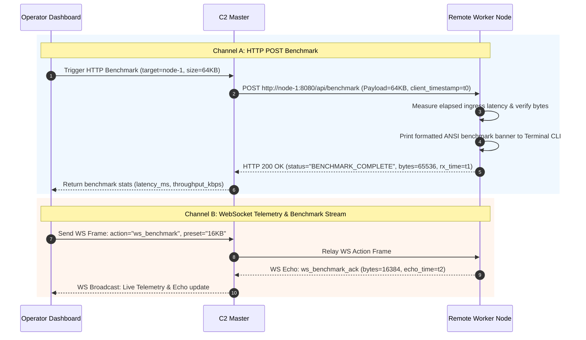
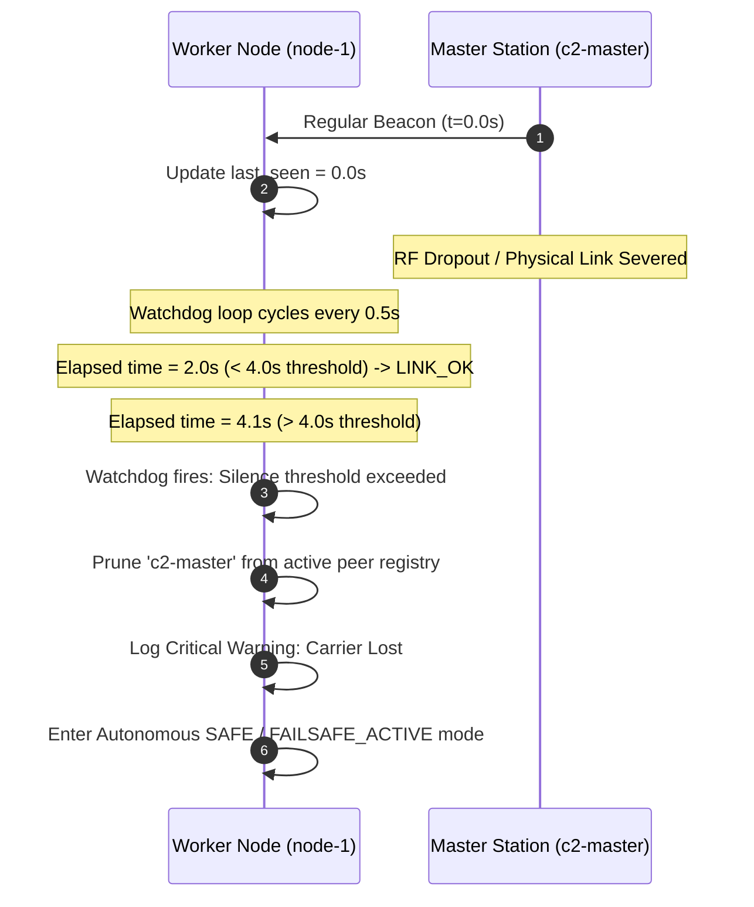

# Command and Control (C2) Wireless Network PoC: Engineering Dossier

**Document Classification:** Technical Architecture & PoC Evaluation Report  
**Target System:** C2 Wireless Network Proof-of-Concept Testbed  
**Repository:** `c2-wireless-poc`  
**Primary Language & Runtime:** Python 3.10+ (`aiohttp`, `asyncio`), Vanilla JavaScript / Alpine.js  
**Type Safety:** `mypy --strict` compliance across core modules and test suites  

---

## 1. Executive & Technical Summary

### 1.1 Mission Statement & Problem Domain
Modern robotic platforms, unmanned aerial/ground vehicles (UxVs), and field-deployed distributed sensor nodes require resilient, low-latency Command and Control (C2) communication. Operating over dynamic, non-deterministic wireless links (standard Wi-Fi, tactical mesh, or cellular relays) presents distinct operational challenges:
- Unpredictable RF fading, packet jitter, and intermittent dropouts.
- Network segmentation caused by wireless access point (AP) client isolation or multi-subnet routing.
- Protocol vulnerabilities when untrusted network packets are parsed by mission-critical edge daemons.
- The necessity of immediate, autonomous failsafe transitions upon loss of carrier or command signal.

The **C2 Wireless Network Proof-of-Concept (PoC)** is an airtime-optimized, zero-dependency software suite designed to validate, benchmark, and monitor multi-node wireless communications between a central Command Station (PC0 Master) and distributed remote agents (PC1–PCn Workers).

```
                      ┌────────────────────────────────────────┐
                      │            C2 Master (PC0)             │
                      │  • Web Dashboard: http://localhost:9000│
                      │  • Live Node Grid, Latency & Controls  │
                      │  • Interactive Data Transfer Lab       │
                      └──────────────────┬─────────────────────┘
                                         │ Gigabit LAN / Wi-Fi
                 ┌───────────────────────┴───────────────────────┐
                 │               Wireless Network                │
                 │   • UDP 9876: Auto-discovery, RTT & Jitter    │
                 │   • TCP 9877: Guaranteed C2 Commands (PING)   │
                 │   • HTTP 8080: JSON REST API & Benchmarks     │
                 │   • WS 8080/ws: Real-time Telemetry Stream    │
                 └───────┬─────────────────┬─────────────────┬───┘
                         │ Wireless / LAN  │ Wireless / LAN  │ Wireless / LAN
              ┌──────────┴──────┐ ┌────────┴──────┐ ┌────────┴──────┐
              │   Node 1 (PC1)  │ │  Node 2 (PC2) │ │  Node 5 (PC3) │
              │   Worker Daemon │ │ Worker Daemon │ │ Worker Daemon │
              └─────────────────┘ └───────────────┘ └───────────────┘
```

### 1.2 Architectural Principles
1. **Zero External Core Dependencies:** The core daemon relies strictly on standard Python libraries (`asyncio`, `socket`, `dataclasses`, `argparse`) with the single production dependency of `aiohttp` for asynchronous HTTP and WebSocket transports.
2. **Strict Untrusted Boundary Enforcement:** All network ingestion points (UDP datagrams, TCP command streams, HTTP REST JSON, WebSocket frames) pass through validation parsers in `c2_protocol.py` that enforce byte boundaries, encoding checks, structural schemas, and bounds checking.
3. **Decoupled Asynchronous Multi-Channel Transport:** Control, telemetry, discovery, and heavy payload benchmarking operate across dedicated transport channels to prevent throughput bursts from blocking high-priority health heartbeats.
4. **Autonomous Edge Safety Watchdog:** Worker nodes continuously monitor incoming master communication. If the connection lapses beyond the critical threshold (4.0 seconds), the worker immediately purges the master from active peers and initiates autonomous failsafe protocols.

---

## 2. System Architecture & Network Topology

### 2.1 Multi-Channel Network Matrix
The C2 node daemon (`c2_node.py`) coordinates four distinct communication channels, each assigned to an optimized transport layer:

| Port | Protocol | Layer / Format | Primary Function | Frequency / Bound |
| :--- | :--- | :--- | :--- | :--- |
| **9876** | **UDP** | Broadcast / Unicast JSON | Node Auto-Discovery, RTT, Jitter & Loss tracking | 1.0 Hz periodic |
| **9877** | **TCP** | Line-delimited JSON Stream | Guaranteed C2 Operational Commands (`PING`) | On-demand |
| **8080** / **9000** | **HTTP** | REST API (`application/json`) | Node inspection (`/api/status`), Benchmarks (`/api/benchmark`) | On-demand |
| **8080** / **9000** | **WebSocket** | Duplex JSON Frames | Live Telemetry Stream (`/ws`), Bi-directional benchmarking | 2.0 Hz streaming |

*Note: By default, Worker nodes host their HTTP/WS services on port `8080`, while the Master station hosts on port `9000` to serve the Operator Web Dashboard.*

### 2.2 System Topology Architecture



### 2.3 Operational Configuration Constants (`config.py`)
All core timing, networking, and benchmarking defaults are encapsulated in `C2Config` dataclass instances, configurable via environment variables:

```python
@dataclass
class C2Config:
    udp_beacon_port: int = int(os.getenv("C2_UDP_PORT", "9876"))
    tcp_cmd_port: int = int(os.getenv("C2_TCP_PORT", "9877"))
    http_worker_port: int = int(os.getenv("C2_HTTP_WORKER_PORT", "8080"))
    http_master_port: int = int(os.getenv("C2_HTTP_MASTER_PORT", "9000"))
    beacon_interval_sec: float = 1.0       # 1 Hz Discovery & Link health
    failsafe_timeout_sec: float = 4.0     # Maximum peer silence threshold
    link_history_window: int = 30          # Rolling sample depth for Jitter/Loss
    benchmark_sizes = {
        "1KB": 1024,
        "16KB": 16 * 1024,
        "64KB": 64 * 1024,
        "256KB": 256 * 1024,
    }
```

---

## 3. Wire Protocol & Data Contracts (`c2_protocol.py`)

A primary vulnerability in distributed embedded systems is deserialization of untrusted network datagrams. The C2 testbed implements strict safety boundaries and explicit schemas before routing any payload to internal logic.

### 3.1 Input Boundary Limits
```python
MAX_DATAGRAM_SIZE     = 65507          # Max theoretical IPv4 UDP datagram payload
MAX_TCP_FRAME_SIZE    = 65536          # 64 KB per line-delimited TCP command frame
MAX_HTTP_PAYLOAD_SIZE = 10 * 1024 * 1024 # 10 MB maximum HTTP request body limit
```

Any datagram or frame exceeding these thresholds is dropped immediately with a `C2ParseError` before memory allocations or JSON parsing occur.

### 3.2 Protocol Data Contracts

#### A. UDP Discovery Beacon (`BeaconMessage`)
Beacons are emitted once per second by all active nodes over UDP broadcast (`255.255.255.255:9876`) and directed unicast.

```json
{
  "node_id": "node-1",
  "role": "worker",
  "seq": 142,
  "timestamp": 1725883200.1245,
  "start_time": 1725883058.0000,
  "http_port": 8080,
  "tcp_port": 9877,
  "cpu_load": 12.4
}
```

**Field Validation Constraints:**
- `node_id`: Non-empty string, length $\le 64$ characters.
- `role`: Case-insensitive match against `{"master", "worker"}` (normalized to lowercase).
- `seq`: Strictly positive integer $\ge 1$.
- `timestamp` / `start_time`: Finite floating-point numbers ($\text{not } \text{NaN}, \pm\infty$).
- `http_port` / `tcp_port`: Valid TCP/IP port range ($1 \le \text{port} \le 65535$).
- `cpu_load`: Finite float between $0.0\%$ and $100.0\%$.

#### B. TCP Command Frame (`C2CommandRequest`)
Line-delimited JSON payload sent across a direct TCP stream (`port 9877`).

```json
{
  "command": "PING",
  "target_id": "node-1",
  "args": {}
}
```

**Field Validation Constraints:**
- `command`: Whitelisted command identifier (strictly restricted to `{"PING"}`). Dangerous or unvalidated verbs (e.g. `ARM`, `SAFE`, `ESTOP`) are explicitly rejected with `C2ParseError` at the parser level.
- `target_id`: String identifier indicating the target node or `"all"`.
- `args`: Key-value JSON dictionary for arbitrary parameters.

#### C. HTTP Benchmark Request (`BenchmarkRequest`)
Payload dispatched via `POST /api/benchmark` to measure end-to-end request-response latency and data transfer rate.

```json
{
  "preset": "64KB",
  "client_timestamp": 1725883201.502,
  "data": "... [arbitrary text or benchmark payload string] ..."
}
```

#### D. WebSocket Benchmark Frame (`WsBenchmarkRequest`)
Bi-directional frame transmitted over the active `/ws` connection.

```json
{
  "action": "ws_benchmark",
  "target_id": "node-1",
  "preset": "16KB",
  "timestamp": 1725883202.100,
  "data": "... [benchmark burst stream] ..."
}
```

### 3.3 Protocol Sequence Workflows

#### Auto-Discovery & Unicast Registration Fallback
When a node starts, it broadcasts beacons to the local subnet. In environments where broadcast traffic is filtered or across routed links, workers automatically execute directed unicast beaconing to the Master IP.



#### Dual-Channel Benchmark Flow (HTTP vs. WebSocket)



#### Peer Silence Watchdog & Failsafe Execution



---

## 4. Node Implementation & Runtime Engine (`c2_node.py`)

The universal daemon (`C2NodeDaemon`) runs identically on master and worker platforms, parameterized by CLI flags (`--id`, `--role`, `--port-http`, `--port-tcp`, `--port-udp`, `--master-ip`).

### 4.1 Asynchronous Concurrency Architecture
The runtime engine executes on top of the native Python `asyncio` event loop coupled with `aiohttp.web.Application`:

```
┌────────────────────────────────────────────────────────────────────────┐
│                        asyncio Event Loop                              │
│                                                                        │
│  ┌───────────────────────┐  ┌───────────────────────────────────────┐  │
│  │  UDPBeaconProtocol    │  │  TCP Command Server                   │  │
│  │  • asyncio datagram   │  │  • asyncio.start_server (:9877)       │  │
│  │  • Broadcast & Unicast│  │  • Line-delimited stream reader       │  │
│  └───────────────────────┘  └───────────────────────────────────────┘  │
│                                                                        │
│  ┌──────────────────────────────────────────────────────────────────┐  │
│  │  aiohttp.web Application (:8080 / :9000)                         │  │
│  │  • GET /api/status          • POST /api/command                  │  │
│  │  • POST /api/benchmark      • GET /ws (WebSocket Manager)        │  │
│  │  • GET / (Static Dashboard UI - Master Only)                     │  │
│  └──────────────────────────────────────────────────────────────────┘  │
│                                                                        │
│  ┌───────────────────────┐  ┌───────────────────────────────────────┐  │
│  │ beacon_broadcast_loop │  │ watchdog_loop                         │  │
│  │ • 1 Hz timer          │  │ • 0.5 Hz timer: Prune stale peers     │  │
│  └───────────────────────┘  └───────────────────────────────────────┘  │
│                                                                        │
│  ┌──────────────────────────────────────────────────────────────────┐  │
│  │ telemetry_broadcast_loop                                         │  │
│  │ • 2 Hz timer: Broadcast JSON telemetry to active WebSockets      │  │
│  └──────────────────────────────────────────────────────────────────┘  │
└────────────────────────────────────────────────────────────────────────┘
```

### 4.2 Link Quality & Rolling Statistics Engine
Every discovered peer is tracked within a `NodeMetrics` instance in memory. Rather than relying on simple instantaneous values, `C2NodeDaemon` maintains a rolling window of recent samples (`link_history_window = 30`):

1. **Round-Trip Time (RTT):**
   Calculated when a responding beacon is processed:
   $$\text{RTT} = (t_{\text{current}} - t_{\text{beacon\_tx}}) \times 1000 \quad [\text{ms}]$$
   A moving average is maintained over the sample history:
   $$\overline{\text{RTT}} = \frac{1}{N} \sum_{i=1}^{N} \text{RTT}_i$$

2. **Statistical Jitter:**
   Defined as the mean deviation between consecutive latency measurements over the historical window:
   $$\text{Jitter} = \frac{1}{N-1} \sum_{i=1}^{N-1} \left| \text{RTT}_{i+1} - \text{RTT}_i \right| \quad [\text{ms}]$$

3. **Sequence-Based Packet Loss:**
   When an incoming beacon with sequence number $S_{\text{new}}$ is received following $S_{\text{prev}}$:
   $$\Delta_{\text{seq}} = S_{\text{new}} - S_{\text{prev}}$$
   If $\Delta_{\text{seq}} > 1$, the lost packet count is incremented by $\Delta_{\text{seq}} - 1$. Packet loss percentage is evaluated over the total expected packet count:
   $$\text{Loss \%} = \left( \frac{\text{Packets Lost}}{\text{Packets Sent}} \right) \times 100$$

### 4.3 Failsafe Watchdog Engine
The watchdog task evaluates all known peers every $500\text{ ms}$. If:
$$(t_{\text{now}} - \text{peer.last\_seen}) > \text{config.failsafe\_timeout\_sec} \ (4.0\text{s})$$
The daemon executes:
1. Emits a `CRITICAL` log warning identifying the expired node.
2. Removes the peer from the internal `peers` dictionary.
3. If the worker loses contact with its designated master node, it transitions internal operational states to prevent unmonitored actuators or companion systems from operating without active ground supervision.

### 4.4 ANSI Live Telemetry & Benchmark Banner
To support remote debugging over headless SSH sessions, `c2_node.py` formats all received benchmark transfers with high-visibility terminal ANSI banners displaying payload verification, byte counts, and throughput.

---

## 5. Operator Web Dashboard (`web/index.html`)

The master node provides an embedded, self-contained single-page application (SPA) served via `aiohttp` on port `9000`.

```
========================================================================================
 C2 WIRELESS COMMAND & CONTROL DASHBOARD                           [All Systems Nominal]
========================================================================================
 [PING ALL NODES]                                      Active Discovered Workers: 3 

 ┌─ node-1 (192.168.1.101) ──┐ ┌─ node-2 (192.168.1.102) ──┐ ┌─ node-3 (192.168.1.103) ──┐
 │ RTT: 2.14 ms              │ │ RTT: 3.45 ms              │ │ RTT: 1.89 ms              │
 │ Jitter: 0.32 ms           │ │ Jitter: 0.81 ms           │ │ Jitter: 0.21 ms           │
 │ Loss: 0.0%                │ │ Loss: 0.0%                │ │ Loss: 0.0%                │
 │ CPU: 8.4% | Up: 420s      │ │ CPU: 14.1% | Up: 420s     │ │ CPU: 6.2% | Up: 420s      │
 │ [ PING NODE ]             │ │ [ PING NODE ]             │ │ [ PING NODE ]             │
 └───────────────────────────┘ └───────────────────────────┘ └───────────────────────────┘

 ┌── DATA TRANSFER & BENCHMARK LAB ────────────────────────────────────────────────────┐
 │ Target Node: [ node-1 (192.168.1.101) ▼ ]     Channel: (•) HTTP POST   ( ) WebSocket│
 │ Payload Preset: ( ) 1 KB   ( ) 16 KB   (•) 64 KB   ( ) 256 KB   ( ) Custom JSON     │
 │ Payload Size: 65,536 bytes                                                          │
 │ [ RUN BENCHMARK TRANSFER ]                                                          │
 │ Latency: 4.12 ms | Throughput: 15,892.4 KB/s (15.52 MB/s) | Status: SUCCESS         │
 └─────────────────────────────────────────────────────────────────────────────────────┘
```

### 5.1 Dashboard Architecture & Technology Choices
- **Zero Build Step:** Built with vanilla HTML5 and Alpine.js (`web/alpine.min.js`), requiring no Node.js compilation, npm modules, or external CDN access. It runs entirely air-gapped on private subnets.
- **Strict Clean Light Theme:** Designed with a high-contrast industrial UI palette (neutral slate borders `#e2e8f0`, dark slate headers `#0f172a`, clear semantic badges for link health).
- **Dual Telemetry Consumption:**
  - **Polling Fallback:** Automatic 2-second HTTP polling to `/api/status` ensures UI updates even if WebSocket streams encounter proxy barriers.
  - **Live WebSocket Stream:** Connects to `/ws` for sub-second telemetry updates and bi-directional benchmarking.

### 5.2 Interactive Data Transfer Lab
The lab allows ground station operators to test link throughput across varying message sizes:
1. **Target Selector:** Automatically populates with dynamically discovered active worker nodes.
2. **Channel Selection:** Toggle between HTTP POST (stateless REST) and WebSocket duplex framing.
3. **Payload Presets:** Quick selection of 1 KB, 16 KB, 64 KB, and 256 KB standard payloads, or a Custom JSON payload editor equipped with real-time character and byte counting.
4. **Metric Display:** Instantly computes and displays transfer latency ($ms$), throughput ($KB/s$ and $MB/s$), and returned JSON server response headers.

---

## 6. Benchmark Framework & Measurement Methodology

The C2 testbed provides an objective framework for characterizing wireless links under varying RF conditions and payload loads.

### 6.1 Throughput & Latency Calculations

#### A. Ingress Duration ($T_{\text{ingress}}$)
Measured directly on the receiving node from the client timestamp embedded in the payload to the local receipt time:
$$T_{\text{ingress}} = (t_{\text{server\_rx}} - t_{\text{client\_tx}}) \times 1000 \quad [\text{ms}]$$

#### B. Total Round-Trip Transfer Time ($T_{\text{total}}$)
Measured at the initiating client:
$$T_{\text{total}} = (t_{\text{client\_ack\_rx}} - t_{\text{client\_tx}}) \times 1000 \quad [\text{ms}]$$

#### C. Effective Throughput ($R_{\text{effective}}$)
Computed over the transferred payload bytes ($B_{\text{payload}}$):
$$R_{\text{KB/s}} = \frac{B_{\text{payload}} / 1024}{T_{\text{total}} / 1000} \quad \left[\frac{\text{KB}}{\text{s}}\right]$$

$$R_{\text{MB/s}} = \frac{R_{\text{KB/s}}}{1024} \quad \left[\frac{\text{MB}}{\text{s}}\right]$$

### 6.2 Dual-Protocol Benchmark Comparison

| Parameter | HTTP POST Benchmark (`/api/benchmark`) | WebSocket Stream Benchmark (`/ws`) |
| :--- | :--- | :--- |
| **Transport Model** | Request-Response over transient or pooled TCP | Persistent, full-duplex TCP socket |
| **Connection Overhead**| Incurs HTTP header parsing and connection handshakes | Zero framing overhead post-handshake |
| **Backpressure** | Managed by TCP window and HTTP chunking | Direct socket buffer streaming |
| **Ideal Operational Use**| Discrete mission logs, sensor dumps, point queries | Continuous video/telemetry feeds, streaming C2 |

### 6.3 Programmatic CLI Testing Procedures (curl)

Operators and automated test rigs can trigger benchmarks directly from the command line:

```bash
# 1. Query Node System & Peer Health
curl -s http://<WORKER_IP>:8080/api/status | jq .

# 2. Dispatch Direct PING Command
curl -s -X POST http://<WORKER_IP>:8080/api/command \
  -H "Content-Type: application/json" \
  -d '{"command": "PING", "target_id": "node-1"}' | jq .

# 3. Execute 64 KB Benchmark via HTTP POST
curl -s -X POST http://<WORKER_IP>:8080/api/benchmark \
  -H "Content-Type: application/json" \
  -d "{
    \"preset\": \"64KB\",
    \"client_timestamp\": $(python3 -c 'import time; print(time.time())'),
    \"data\": \"$(python3 -c 'print("A" * 65536)')\"
  }" | jq .
```

---

## 7. Verification & Quality Assurance Suite

The repository contains a multi-tier automated test suite verifying static typing, parser robustness against malicious inputs, API handlers, and full multi-process system integration.

```
                  ┌────────────────────────────────────────┐
                  │          Verification Suite            │
                  └──────────────────┬─────────────────────┘
                                     │
         ┌───────────────────────────┼───────────────────────────┐
         │                           │                           │
┌────────┴────────┐         ┌────────┴────────┐         ┌────────┴────────┐
│   Static Type   │         │ Unit & Boundary │         │ Multi-Process   │
│ Checking (mypy) │         │ Testing(pytest) │         │ E2E (test_e2e)  │
│ • Strict mode   │         │ • 29 Parsers    │         │ • UDP Discovery │
│ • All modules   │         │ • 18 Servers    │         │ • HTTP & WS     │
│ • 100% typed    │         │ • 47/47 Passing │         │ • 4s Failsafe   │
└─────────────────┘         └─────────────────┘         └─────────────────┘
```

### 7.1 Static Typing Verification (`mypy --strict`)
All code files (`c2_node.py`, `c2_protocol.py`, `config.py`, `test_e2e.py`, `tests/`) are strictly typed:
```bash
.venv/bin/mypy c2_node.py c2_protocol.py config.py test_e2e.py tests/
```
*Result: Success, zero type errors detected across codebase.*

### 7.2 Parser Security & Untrusted Input Suite (`tests/test_parsers.py`)
Comprises 29 unit tests explicitly targeting input boundary conditions:
- **Corrupted Payloads:** Malformed JSON strings, invalid UTF-8 byte sequences, empty payloads.
- **Oversized Datagram Attacks:** Testing datagrams exceeding `MAX_DATAGRAM_SIZE` (65,507 bytes) and TCP frames exceeding `MAX_TCP_FRAME_SIZE` (64 KB).
- **Type Confusion & Semantic Violations:** Injected string ports, floating-point sequence numbers, and `NaN` or `Inf` CPU metrics.
- **Command Whitelist Enforcement:** Ensuring unauthorized verbs (`ARM`, `SAFE`, `ESTOP`) are immediately rejected at the parser layer.

### 7.3 Server & API Route Test Suite (`tests/test_server.py`)
Comprises 18 integration tests evaluating `aiohttp` web server handlers:
- `GET /api/status`: Verified schema, node ID, and peer dictionary return.
- `OPTIONS /api/*`: Verifies CORS headers across endpoints.
- Static File Serving: Master serves `index.html` and `alpine.min.js`; workers return 404 to ensure role isolation.
- WebSocket Lifecycle: Ingestion of `ws_benchmark` frames, verification of `ws_benchmark_ack` responses, and telemetry broadcasting.
- TCP Server: Client connection, JSON frame submission, and clean disconnects.

```bash
.venv/bin/pytest tests/ -v
# Output: 47 passed in 1.30s (100% pass rate)
```

### 7.4 Multi-Process End-to-End Verification (`test_e2e.py`)
A comprehensive integration harness that verifies full-stack execution:
1. Spawns two independent subprocesses: `test-master` (HTTP :9050, TCP :9857, UDP :9856) and `test-worker-1` (HTTP :8051, TCP :9858, UDP :9856).
2. Verifies mutual UDP auto-discovery across processes.
3. Dispatches HTTP `PING` commands and confirms rejection of invalid verbs.
4. Executes HTTP benchmark transfers for 1 KB, 16 KB, and 64 KB payloads.
5. Connects via WebSocket client to `/ws`, validates live telemetry frames, and sends bi-directional benchmark messages.
6. Terminates the Master process and observes the Worker watchdog cleanly timeout and prune the master from its peer list after $4.5\text{s}$ ($> 4.0\text{s}$ threshold).

---

## 8. Deployment & Operational Runbook

### 8.1 Hardware Prerequisites & Operating System Compatibility
The testbed requires only standard Python 3.10+ and operates seamlessly across:
- **Linux:** Ubuntu 20.04/22.04/24.04, Debian, Raspberry Pi OS, Fedora, Arch Linux.
- **macOS:** macOS 12 (Monterey) through macOS 15+ (Apple Silicon & Intel).
- **Embedded SBCs:** Raspberry Pi 4/5, NVIDIA Jetson Nano/Orin, Orange Pi, Intel NUCs.

### 8.2 Access Point & Wireless Router Configuration (Critical)
To ensure reliable operation over physical wireless links:

1. **AP / Client Isolation (MANDATORY):**
   - **DISABLE** Client Isolation (also designated *Station Isolation*, *AP Isolation*, or *Guest Mode*).
   - *Rationale:* When enabled, the access point blocks direct peer-to-peer frames, preventing UDP auto-discovery beacons and direct TCP/HTTP communication between worker nodes and the master station.
2. **Band Separation & Channel Pinning:**
   - Separate 2.4 GHz and 5 GHz networks into distinct SSIDs (e.g. `C2-NET-5G` and `C2-NET-2.4G`).
   - Connect operational nodes to **5 GHz (or 6 GHz)** to minimize channel contention, RF noise, and latency spikes.
3. **Airtime Fairness Tuning:**
   - Disable router *Airtime Fairness*. Certain AP implementations artificially delay small UDP datagrams when servicing slower legacy devices, introducing artificial jitter.
4. **WMM & Power-Saving:**
   - Disable aggressive Wi-Fi power-saving (802.11 PS-Mode) on client wireless network cards (`iwconfig wlan0 power off` on Linux).

### 8.3 Operational Bootstrap Workflow

#### Step 1: Environment Setup (All Nodes)
```bash
git clone <REPO_URL> c2-wireless-poc
cd c2-wireless-poc
chmod +x scripts/*.sh
./scripts/setup.sh
```

#### Step 2: Launch C2 Master Station (PC0 / Ground Station)
Connect PC0 to the network (preferably via Gigabit Ethernet to minimize ground jitter):
```bash
./scripts/run_master.sh c2-master 9000
```
Open browser to `http://localhost:9000` to view the live dashboard.

#### Step 3: Launch Worker Nodes (PC1–PCn)
On each remote node connected to the wireless SSID:
```bash
# Standard local subnet deployment (Broadcast Discovery):
./scripts/run_worker.sh node-1

# Routed subnet or VLAN deployment (Directed Unicast to Master IP):
./scripts/run_worker.sh node-1 192.168.1.100
```
Within 1 second, the node will appear on the Master Dashboard grid.

---

## 9. Production Readiness, Gap Analysis & Hardening Roadmap

While the PoC fulfills all functional requirements for protocol validation and link benchmarking, transitioning the testbed to a mission-critical or defense-grade deployment requires addressing specific architectural and operational gaps:

```
┌────────────────────────────────────────────────────────────────────────────────────────┐
│                                 PRODUCTION ROADMAP                                     │
├──────────────────────────┬──────────────────────────┬──────────────────────────────────┤
│ 1. Security & Auth       │ 2. High Availability     │ 3. RF & Link Layer               │
│ • Mutual TLS (mTLS)      │ • Raft/Paxos Multi-Master│ • Wi-Fi 6 OFDMA / MU-MIMO        │
│ • DTLS / WireGuard Mesh  │ • Leader Election        │ • Dual-Radio Cellular Bonding    │
│ • HMAC Payload Signing   │ • Split-Brain Resolution │ • Frequency Hopping / Mesh Ad-hoc│
└──────────────────────────┴──────────────────────────┴──────────────────────────────────┘
```

### 9.1 Security & Cryptographic Protection
- **Current State:** Plaintext HTTP, unencrypted WebSockets, unauthenticated UDP beacons.
- **Production Vulnerabilities:** Susceptible to packet eavesdropping, spoofed beacon injection, rogue node registration, and man-in-the-middle (MITM) command execution.
- **Hardening Recommendations:**
  1. **Transport Layer Security:** Enforce Mutual TLS (mTLS) with client certificates on all HTTP REST and WebSocket connections (`https://` and `wss://`).
  2. **UDP Datagram Authentication:** Implement HMAC-SHA256 signatures over UDP beacons using pre-shared mission keys, or tunnel all UDP/TCP traffic through an encrypted kernel-level overlay (e.g. WireGuard mesh).
  3. **Role-Based Access Control (RBAC):** Introduce short-lived JWTs or cryptographically signed challenge-response tokens for command dispatch.

### 9.2 High Availability & Redundant Master Architecture
- **Current State:** Single C2 Master station represents a single point of failure (SPOF).
- **Production Vulnerabilities:** If PC0 goes offline, workers transition to failsafe mode, halting mission execution.
- **Hardening Recommendations:**
  1. **Consensus-Based Master Clustering:** Implement a distributed consensus protocol (e.g., Raft via `raft-py` or etcd) across multiple ground stations.
  2. **Dynamic Master Failover:** Workers maintain a prioritized list of fallback Master IPs, re-targeting registration beacons when the primary leader fails heartbeat checks.

### 9.3 Physical Layer (RF) & Transport Resiliency
- **Current State:** Single standard 802.11 Wi-Fi interface.
- **Production Vulnerabilities:** Susceptible to intentional RF jamming, co-channel microwave interference, and multipath fading.
- **Hardening Recommendations:**
  1. **Multi-Interface Bonding:** Implement multi-homed carrier aggregation bonding (e.g., simultaneous 5 GHz Wi-Fi + private 4G/5G LTE + satellite relay) using MPTCP (Multipath TCP) or bonding interfaces.
  2. **Tactical Ad-Hoc Mesh:** Integrate 802.11s or B.A.T.M.A.N.-adv mesh routing so remote workers out of direct master radio range can hop packets through intermediate worker nodes.

### 9.4 Telemetry Storage & Analytical Observability
- **Current State:** In-memory rolling window of 30 samples; metrics are volatile.
- **Production Recommendations:**
  1. Export metrics in Prometheus format (`/metrics`) to support Grafana alerting dashboards.
  2. Persist real-time time-series telemetry to local SQLite or TimescaleDB instances for post-mission blackbox flight and communications playback.

---

## 10. Conclusion & Verification Summary

The C2 Wireless Network PoC establishes a lean, highly resilient, and verifiable communication baseline for distributed command and control systems. Through strict type safety (`mypy`), untrusted input boundary validation (`c2_protocol.py`), low-overhead asynchronous networking (`aiohttp` / `asyncio`), and an integrated Data Transfer Lab, the testbed provides engineering teams with the exact tools needed to stress-test and quantify wireless links before fielding critical robotic systems.

### Summary Verification Status
- **Core Architecture:** Decoupled multi-channel transport (UDP 9876, TCP 9877, HTTP/WS 8080/9000) $\rightarrow$ **Operational**
- **Type Safety:** 100% `mypy` strict mode compliance $\rightarrow$ **Verified**
- **Unit & Security Tests:** 47/47 passing tests in `pytest` $\rightarrow$ **Verified**
- **Failsafe Autonomy:** 4.0-second carrier loss watchdog $\rightarrow$ **Verified**
- **Operator Interface:** Zero-dependency Alpine.js Data Transfer Lab $\rightarrow$ **Operational**
