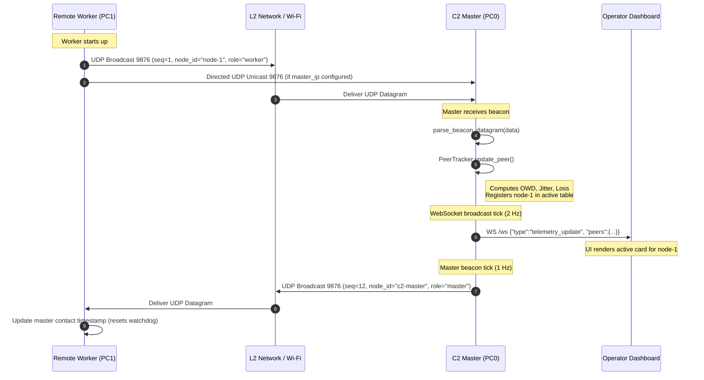
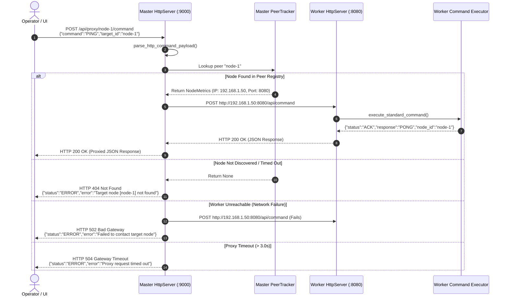
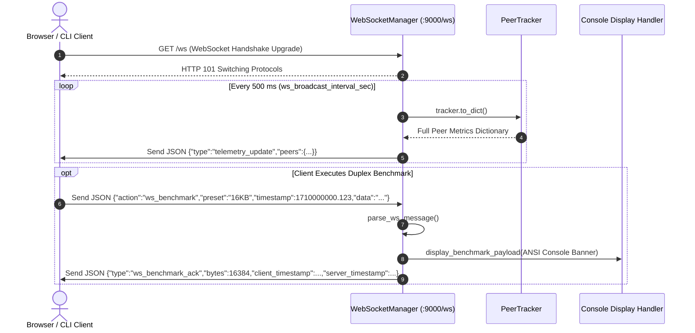
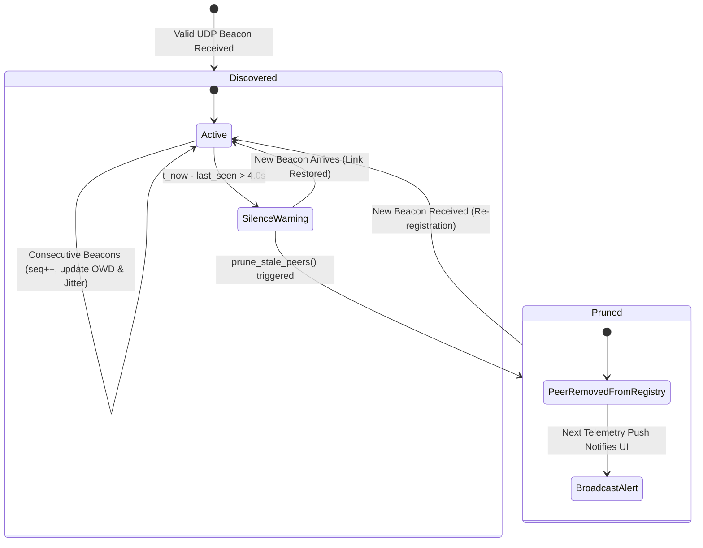

```mermaid
graph TD
    subgraph GroundStation["C2 Master (Ground Station)"]
        Browser["Operator Browser (SPA)"]
        MasterDaemon["C2NodeDaemon (Master)"]
        MasterWeb["HttpServer :9000"]
        MasterWS["WebSocketManager :9000/ws"]
        MasterTracker["PeerTracker (Registry)"]
        MasterBeacon["BeaconService :9876 (UDP)"]
        MasterTCP["TcpCommandServer :9877 (TCP)"]
    end

    subgraph FieldWorker1["Remote Worker 1"]
        W1Daemon["C2NodeDaemon (Worker 1)"]
        W1Beacon["BeaconService :9876 (UDP)"]
        W1HTTP["HttpServer :8080 (REST/WS)"]
        W1TCP["TcpCommandServer :9877 (TCP)"]
        W1Tracker["PeerTracker"]
    end

    subgraph FieldWorkerN["Remote Worker n"]
        WNDaemon["C2NodeDaemon (Worker n)"]
        WNBeacon["BeaconService :9876 (UDP)"]
        WNHTTP["HttpServer :8080 (REST/WS)"]
        WNTCP["TcpCommandServer :9877 (TCP)"]
        WNTracker["PeerTracker"]
    end

    Browser <-->|HTTP REST & WebSockets| MasterWeb
    MasterWeb <--> MasterWS
    MasterDaemon --- MasterTracker
    MasterDaemon --- MasterBeacon
    MasterDaemon --- MasterTCP

    MasterBeacon <.->|UDP 9876 Broadcast & Unicast| W1Beacon
    MasterBeacon <.->|UDP 9876 Broadcast & Unicast| WNBeacon

    MasterWeb -->|HTTP /api/proxy Forward| W1HTTP
    MasterWeb -->|HTTP /api/proxy Forward| WNHTTP

    W1Daemon --- W1Beacon
    W1Daemon --- W1HTTP
    W1Daemon --- W1TCP
    W1Daemon --- W1Tracker

    WNDaemon --- WNBeacon
    WNDaemon --- WNHTTP
    WNDaemon --- WNTCP
    WNDaemon --- WNTracker
```

# C2 Wireless Network Proof-of-Concept — System Architecture Specification

## 1. Executive Summary & Architecture Overview

The **C2 Wireless Network Proof-of-Concept** testbed is an asynchronous, event-driven Command and Control (C2) distributed communication framework built on Python 3 and `asyncio`. It is designed for low-latency telemetry monitoring, link quality estimation, reliable command dispatch, and throughput benchmarking across mixed wireless and wired IP networks.

The system deploys as a cluster consisting of a single **C2 Master** (ground station / operator console) and multiple **Remote Workers** (field nodes, autonomous rovers, drones, or companion computers).

```
                      ┌────────────────────────────────────────┐
                      │            C2 Master (PC0)             │
                      │  • Web Dashboard: http://localhost:9000│
                      │  • Live Node Grid, Latency & Controls  │
                      │  • Master Command Proxy (/api/proxy)   │
                      │  • Interactive Data Transfer Lab       │
                      └──────────────────┬─────────────────────┘
                                         │ Gigabit LAN / Wi-Fi
                 ┌───────────────────────┴───────────────────────┐
                 │               Wireless Network                │
                 │   • UDP 9876: Auto-discovery, Latency & Jitter│
                 │   • TCP 9877: Guaranteed Line Commands (PING) │
                 │   • HTTP 9000/8080: REST API & Benchmarking   │
                 │   • WS 9000/8080: Real-time Telemetry Stream  │
                 └───────┬─────────────────┬─────────────────┬───┘
                         │ Wireless / LAN  │ Wireless / LAN  │ Wireless / LAN
              ┌──────────┴──────┐ ┌────────┴──────┐ ┌────────┴──────┐
              │   Node 1 (PC1)  │ │  Node 2 (PC2) │ │  Node n (PCn) │
              │   Worker Node   │ │  Worker Node  │ │  Worker Node  │
              └─────────────────┘ └───────────────┘ └───────────────┘
```



---

## 2. Core Subsystems

Every node in the network runs a single process instance of [`C2NodeDaemon`](../src/node.py), which orchestrates five cooperating, asynchronous subsystems:

### 2.1 C2NodeDaemon (`src/node.py`)

The central lifecycle supervisor and dependency injector:
- **Local IP Resolution:** Resolves the primary outbound network interface address by creating an unconnected probe socket against the Master IP or default DNS route (`8.8.8.8:80`) without transmitting network traffic.
- **Subsystem Orchestration:** Instantiates and starts the `PeerTracker`, `BeaconService`, `TcpCommandServer`, and `HttpServer`.
- **Fail-Safe Watchdog:** Runs a periodic background task on worker nodes that monitors time elapsed since the last beacon received from the Master.
- **Signal Handling:** Traps `SIGINT` and `SIGTERM` to coordinate graceful socket shutdown, client disconnection, and resource deallocation.

### 2.2 BeaconService & UDPBeaconProtocol (`src/beacon.py`)

Handles zero-configuration peer discovery and continuous link health telemetry over UDP port `9876`:
- **Socket Configuration:** Uses `asyncio.DatagramProtocol` bound to `0.0.0.0:9876` with `SO_REUSEADDR`, `SO_BROADCAST`, and (where supported on Linux/macOS) `SO_REUSEPORT` enabled.
- **Dual-Target Transmission Strategy:**
  1. **Subnet Broadcast:** Transmits datagrams to `<broadcast>:9876` (typically `255.255.255.255`), allowing immediate discovery across local L2 broadcast domains.
  2. **Directed Unicast to Master:** Transmits directly to `master_ip:9876`, enabling nodes across routed subnets, VLANs, or VPNs to register even when UDP broadcast is filtered by intermediate switches or routers.
  3. **Peer-to-Peer Unicast:** Periodically unicasts beacons back to all active peers discovered in the `PeerTracker`, guaranteeing bidirectional link monitoring even on networks with asymmetric broadcast filtering.
- **Beacon Ingestion:** Decodes incoming datagrams, enforces size limits (`MAX_DATAGRAM_SIZE = 65507`), validates the schema via [`parse_beacon_datagram`](../src/protocol.py), and forwards valid messages to the `PeerTracker`.

### 2.3 PeerTracker & Link Quality Mathematics (`src/tracker.py`)

The `PeerTracker` maintains an in-memory registry of active nodes (`Dict[str, NodeMetrics]`) and computes link quality indicators over a rolling sliding window of size $W$ (`config.link_history_window = 30`):

#### A. One-Way Transit Latency (OWD)
The transit latency measures the elapsed time for a beacon to travel from the sender to the receiver:
$$\text{latency}_{\text{sample}} = \max\left(0.1, \left(t_{\text{recv}} - t_{\text{sent}}\right) \times 1000\right) \quad [\text{ms}]$$
$$\text{latency}_{\text{ms}} = \frac{1}{|H|} \sum_{s \in H} s \quad \text{where } H \text{ is the rolling window of samples}$$

> [!IMPORTANT]
> **Host Clock Synchronization:** Because latency is measured from sender transmission timestamp ($t_{\text{sent}}$) to receiver arrival timestamp ($t_{\text{recv}}$), accurate transit latency figures require host clocks to be synchronized across machines via **NTP** (Network Time Protocol) or **PTP** (Precision Time Protocol). Without clock synchronization, the metric reflects clock offset alongside transit delay.

#### B. Wireless Latency Jitter
Jitter represents packet delay variation across consecutive arrivals within the rolling window $H = [s_1, s_2, \dots, s_k]$:
$$\text{jitter}_{\text{ms}} = \frac{1}{k - 1} \sum_{i=1}^{k-1} |s_{i+1} - s_i|$$

#### C. Sequence-Based Packet Loss Estimation
Every emitted beacon carries a strictly monotonic 32-bit integer sequence number ($seq$). Upon receiving sequence $seq$ after previously observing $seq_{\text{last}}$:
- If $seq > seq_{\text{last}}$:
  $$\Delta_{\text{expected}} = seq - seq_{\text{last}}$$
  $$\Delta_{\text{lost}} = \max(0, \Delta_{\text{expected}} - 1)$$
  The pair $(\Delta_{\text{expected}}, \Delta_{\text{lost}})$ is appended to a bounded deque of size $W$. Total loss percentage is calculated as:
  $$\text{packet\_loss\_pct} = \left(\frac{\sum \Delta_{\text{lost}}}{\sum \Delta_{\text{expected}}}\right) \times 100.0$$
- If $seq < seq_{\text{last}}$ (node rebooted or counter wrapped):
  The tracker detects a **sequence reset**, logs an informational event, flushes the historical deque, and resets `packet_loss_pct` to `0.0`.

#### D. Silence Pruning (Fail-Safe)
The tracker evaluates peer inactivity during each beacon cycle. If $t_{\text{now}} - \text{last\_seen} > \tau_{\text{failsafe}}$ (`config.failsafe_timeout_sec = 4.0`), the peer is pruned from the registry and an alert is logged.

### 2.4 TcpCommandServer (`src/server/tcp.py`)

A stream-based socket server listening on TCP port `9877`:
- **Framing:** Strict newline-delimited (`\n`) JSON stream framing.
- **Safety Boundary:** Caps incoming frames at `MAX_TCP_FRAME_SIZE = 65536` (64 KB). Lines exceeding this threshold are immediately rejected with a typed `C2ParseError`.
- **Concurrency:** Operates asynchronously via `asyncio.start_server`, allowing concurrent command clients without thread pool exhaustion.
- **Execution:** Dispatches validated command frames to `execute_standard_command` and returns a formatted JSON acknowledgment line before closing the client socket.

### 2.5 HttpServer & REST Middleware (`src/server/rest.py`)

Powered by `aiohttp.web`, serving REST endpoints on port `9000` (Master) or `8080` (Worker):
- **CORS Middleware (`cors_middleware`):** Injects permissive cross-origin headers (`*`) and intercepts HTTP `OPTIONS` preflight requests with `204 No Content`.
- **Centralized Error Middleware (`error_middleware`):** Catches uncaught exceptions across all route handlers:
  - Maps `C2ParseError` directly to HTTP `400 Bad Request` with field-level error diagnostics.
  - Maps unexpected runtime exceptions to HTTP `500 Internal Server Error`.
  - Preserves standard `aiohttp.web.HTTPException` status codes (such as `404 Not Found`).
- **Master Command Proxy (`/api/proxy/{node_id}/command`):** Allows clients (such as the web browser SPA) to send C2 commands to any worker node through the Master.
  - Resolves target node IP and port from the local `PeerTracker`.
  - Forwards the command via an asynchronous `aiohttp.ClientSession` with a configurable timeout (`master_proxy_timeout_sec = 3.0`).
  - Returns `502 Bad Gateway` if the target worker is unreachable, or `504 Gateway Timeout` if the command times out.
- **Static Asset Delivery:** Master nodes serve the dashboard single-page application (`index.html`, styles, and ES modules) directly from `src/web/`.

### 2.6 WebSocketManager (`src/server/ws.py`)

Manages duplex WebSocket connections over `/ws`:
- **Telemetry Broadcast Loop:** Wakes every `0.5s` (`ws_broadcast_interval_sec`) and pushes a `telemetry_update` frame containing the current peer registry snapshot to all connected clients concurrently using `asyncio.gather`.
- **Duplex Benchmarking:** Accepts `ws_benchmark` action frames, records client and server timestamps, invokes the `display_handler`, and immediately echoes a `ws_benchmark_ack` frame for round-trip latency and throughput calculations.
- **Connection Pruning:** Stale, broken, or slow client connections that exceed a 400 ms write timeout are automatically pruned from the active connection set without blocking other clients.

---

## 3. Protocol Interactions & Sequence Flows

### 3.1 Peer Auto-Discovery & Dynamic Registration



### 3.2 Master Command Proxy Routing

When an operator issues a command from the web dashboard, the request routes through the Master's proxy to avoid browser CORS and private network routing restrictions:



### 3.3 WebSocket Real-Time Telemetry & Benchmarking



---

## 4. Fail-Safe Watchdog State Machine

Both Master and Worker nodes implement fault-tolerant watchdog mechanisms to handle network partitions, Wi-Fi carrier drops, and host crashes:

```
                    ┌─────────────────────────┐
                    │     Active / Linked     │
                    │  Receiving 1 Hz Beacons │
                    └────────────┬────────────┘
                                 │
                 Silence elapsed > 4.0 seconds
                                 │
                                 ▼
                    ┌─────────────────────────┐
                    │    Carrier Loss Warning │
                    │  Logs silence warning   │
                    └────────────┬────────────┘
                                 │
                 Pruning cycle runs in tracker
                                 │
                                 ▼
                    ┌─────────────────────────┐
                    │     Pruned / Offline    │
                    │ Removed from registry   │
                    └─────────────────────────┘
```



### Worker-Side Lost-Link Behavior
On Remote Worker nodes, if communication from the C2 Master ceases for longer than `failsafe_timeout_sec` (4.0 seconds), the worker's `failsafe_watchdog_loop` logs a high-priority warning:
```
[FAILSAFE WATCHDOG] Lost Master contact for 4.2s! Silence threshold exceeded.
```
This hook is structured to allow autonomous vehicles or companion computers to trigger automated safety behaviors (such as Return-To-Home, loitering, or motor cut-off) when link loss is detected.

---

## 5. Frontend Architecture & Offline SPA

The Master node serves a responsive, zero-external-dependency Single Page Application (SPA) from `src/web/`:

```
src/web/
├── index.html        # Clean, strict light theme interface markup
├── styles.css        # Pure CSS design system (variables, responsive grid, monospace telemetry tables)
└── app.js            # ES module containing Alpine.js reactive component logic
```

### Key Architectural Characteristics:
1. **Zero External CDN Dependencies:** All JavaScript and styling assets are hosted locally. The application functions completely offline in air-gapped, field-deployed environments without an active internet connection.
2. **Native ES Module Import Maps:** Modern browsers import Alpine.js via standard HTML import maps:
   ```html
   <script type="importmap">
   {
     "imports": {
       "alpinejs": "./vendor/alpine.esm.js"
     }
   }
   </script>
   ```
3. **Reactive State Synchronization:** The Alpine.js root component (`c2App`) connects to `ws://<host>:<port>/ws` upon page load. Incoming `telemetry_update` messages update reactive Alpine state variables without requiring DOM manipulation libraries or virtual DOM overhead.
4. **Resilient Auto-Reconnection:** If the WebSocket connection drops (e.g., brief Wi-Fi handoff or master daemon restart), an exponential backoff reconnect loop automatically restores the telemetry stream without requiring a browser page refresh.

---

## 6. Codebase Directory Layout & Component Mapping

```
c2-wireless-poc/
├── README.md                 # Primary system overview, hardware setup, and quickstart guide
├── requirements.txt          # Production runtime dependencies (aiohttp)
├── requirements-dev.txt      # Development & verification tooling (mypy, pytest, pytest-asyncio)
├── pytest.ini                # Pytest configuration, markers, and asyncio execution mode
├── mypy.ini                  # Strict static typing rules and boundary checks
│
├── docs/                     # Technical specifications & documentation
│   ├── architecture.md       # This document: system architecture & subsystem breakdown
│   ├── api.md                # Network protocols, wire formats, schemas, and CLI testing
│   └── testing.md            # 3-tier testing architecture, fixtures, and authoring guidelines
│
├── scripts/                  # Operational launch & setup utilities
│   ├── setup.sh              # Automatic environment & dependency bootstrap
│   ├── run_master.sh         # Master ground station launcher with port configuration
│   ├── run_worker.sh         # Worker node launcher with automatic/explicit master IP
│   └── run_tests.sh          # Automated test suite and static type check executor
│
├── src/                      # Application source code
│   ├── config.py             # Global constants, network defaults, and environment overrides
│   ├── protocol.py           # Typed input parsers, boundaries, and validation dataclasses
│   ├── tracker.py            # PeerTracker, NodeMetrics, and link quality mathematics
│   ├── beacon.py             # UDPBeaconProtocol and BeaconService discovery loops
│   ├── presentation.py       # Console ANSI color formatting and benchmark payload sinks
│   ├── node.py               # C2NodeDaemon entry point and async lifecycle coordinator
│   │
│   ├── server/               # Network service layer
│   │   ├── __init__.py       # Server module exports
│   │   ├── commands.py       # Command dispatch & execution handlers (PING)
│   │   ├── tcp.py            # Line-delimited TCP command socket server
│   │   ├── ws.py             # WebSocketManager: live telemetry streaming & benchmarking
│   │   └── rest.py           # HttpServer: aiohttp REST routing, CORS, and Master proxy
│   │
│   └── web/                  # Standalone offline web dashboard
│       ├── index.html        # HTML structure & import map definitions
│       ├── styles.css        # Strict clean light design system
│       ├── app.js            # Reactive Alpine.js frontend logic
│       └── vendor/           # Vendored offline libraries (Alpine.js)
│
└── tests/                    # 3-tier test suite
    ├── conftest.py           # Shared fixtures, factories, and port allocators
    ├── unit/                 # Hermetic unit tests (parsers, trackers, nodes, servers)
    ├── integration/          # Hermetic in-process multi-node cluster flow tests
    └── e2e/                  # Multi-process end-to-end integration tests over loopback
```
